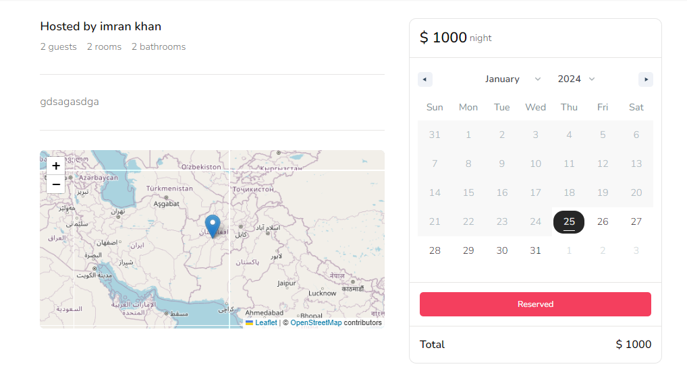
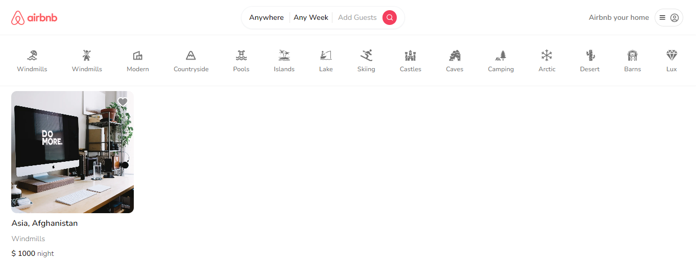

Clone the project

```bash
  git clone https://github.com/Imranul-hoque/booking_system.git
```

Go to the project directory

```bash
  cd my-project
```

Install dependencies

```bash
  npm install
```

Start the server

```bash
  npm run start
```


## Usage
1. setup database for prisma
2. Run the application: `npm start` (or `yarn start`).
3. Open the app in your web browser: `http://localhost:3000`.


## Folder Structure

**Actions** : This folder is concern for database action like getting specific list properties.

**Provider** : provider folder is only concern for application provider

**Prisma** : Prisma ORM for make automate database migrations process easy

**App** : That one is main for the app router in next js. This folder is so important for file based routing system

**Components** : All utility functions goes into components folder

**Hooks** : Custom hook for our application


## Contact

For questions or support, please contact [Your Name] at [imran.contuct@gmail.com].

# Hi, I'm Imranul Hoque! 👋


## 🛠 Tech
`Html` `Css` `Javascript` `Nextjs 13.5` `Tailwindcss` `Typescript` `Nodejs` `Nestjs` and related tech


## Complete Booking system


---


## Key Featured:

## User Authentication and Profiles:
Allow users to create accounts, log in, and manage their profiles.
Include features for users to add personal information, profile pictures, and preferences.

## Property Listings:
Enable property owners to list their accommodations with details such as location, amenities, pricing, and availability.
Support various property types (houses, apartments, rooms, etc.).

## Search and Filters:
Implement a robust search functionality with filters for location, dates, number of guests, and amenities.
Provide a map view for users to explore available properties in specific areas.

## Booking and Reservation System:
Develop a secure booking system allowing users to reserve accommodations for specific dates.
Implement a calendar view to show property availability.

## Acknowledgments
Special thanks to the Next.js community for their valuable contributions and support.


